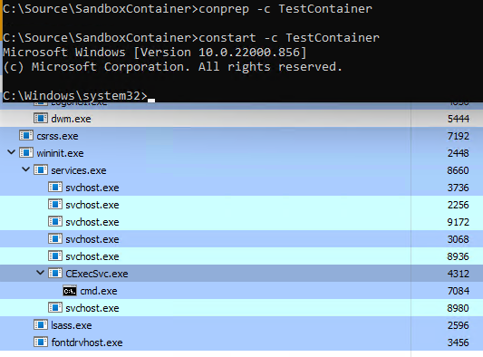

# wincon

## Introduction

This is a POC of creating and running Windows Containers in process isolation mode, using host files and minimal registry information. These type of containers are referred to as **Argon** containers, or **Server Silos** which was implemented since the first release of Windows 10 (10.0.10240). This tool is intended for educational purposes only. 

## Running

First, install the **Containers** Windows feature.

Run as admin:
- conprep.exe -c containerName
- constart.exe -c containerName

## Issues

There may be an issue where CExecSvc.exe will be present but compressed in the SxS folder, the tool doesn't expand it, CExecSvc is important to interact with the container. It can be decompressed using a tool like [SXSEXP](https://github.com/hfiref0x/SXSEXP), and copied into **<Path to Container>\Windows\system32** after preparing the container.

Sometimes the container may stop when starting, I didn't sort this out yet.

## How does it works?

### Preparing the container

The first step is to create the container files. The program enumerates all system files from the host, it creates new links to files that are themselves linked to one of the SxS component listed in **Settings\Files\default.xml**. (*\Windows\WinSxS\<component name part>*). For example, it creates links to all system files that are themselves linked to **amd64_microsoft-windows** components.
It creates links to SysWOW64 files, such as **ntdll.dll**, **verifier.dll** and **win32u.dll**. And finally, it tries to find CExecSvc.exe and create a link to it. **CExecSvc** is the service used to interact with the container, by creating processes in it.

The next step is to create the 5 important hives files: DEFAULTUSER_BASE, SAM_BASE, SECURITY_BASE, SOFTWARE_BASE, and SYSTEM_BASE. The first 3 can be empty, and the last 2 must contain the necessary settings for the container to launch and live (SideBySide configuration, Session Manager, ...), it copies some settings from the host, such as services. The SAM/SECURITY hives file can be empty, because a setting in LSA (**CreatePolicyDatabaseOnFirstBoot**) allows these hives to be generated at launch.

All XML files in the **Settings** folder contain necessary settings for the container to run.

### Launching the container

The first step to start the container is to create a virtual disk storage and format it using the [HCS API](https://docs.microsoft.com/en-us/virtualization/api/hcs/reference/hcsformatwritablelayervhd), which will create and format a single partiton for the container.
Secondly, the disk must be [attached](https://docs.microsoft.com/en-us/windows/win32/api/virtdisk/nf-virtdisk-attachvirtualdisk) and initialized with the writable layer (the layer was previously created by **conprep**).

Once the storage is OK, the container can be started with the proper base layer, mounted to the writable layer.

## Credits

- Me (ldvc)
- [Process Monitor](https://docs.microsoft.com/en-us/sysinternals/downloads/procmon). It would have been incredibly difficult to search for errors without it
- Microsoft for providing the [Host Compute API](https://docs.microsoft.com/en-us/virtualization/api/hcs/overview)
